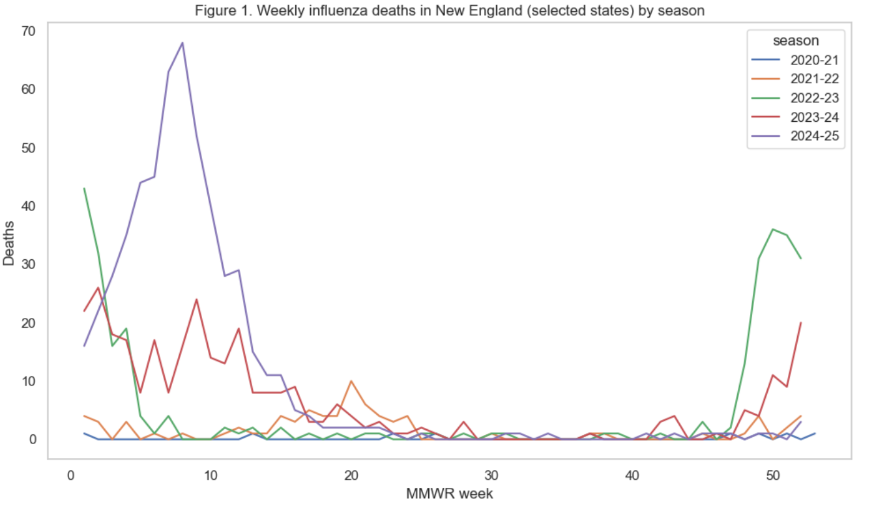
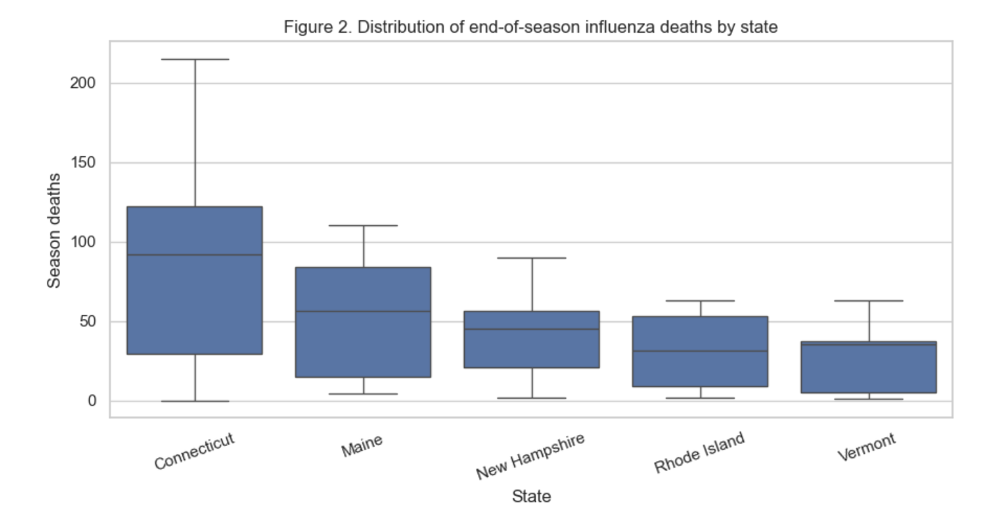
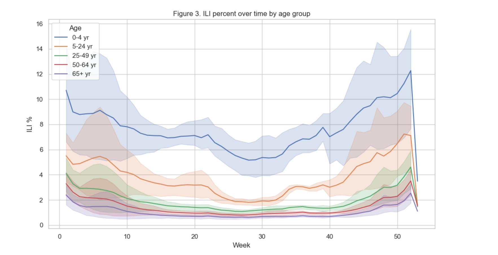
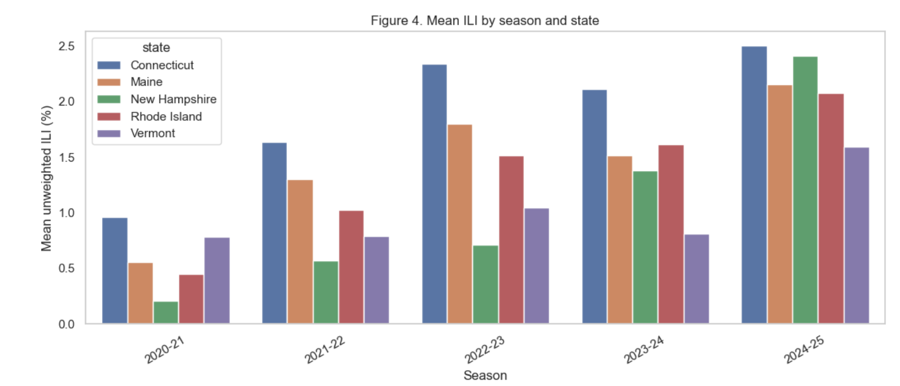
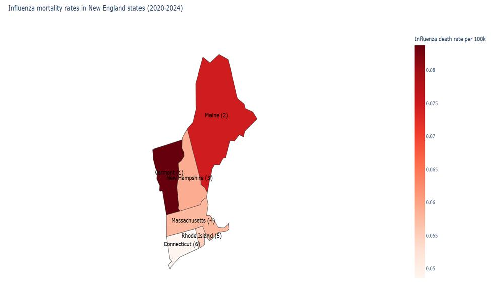
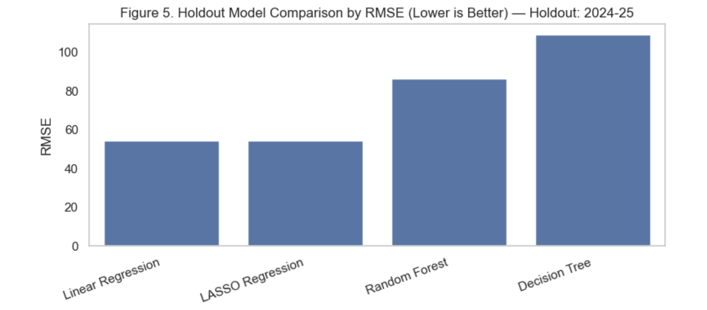
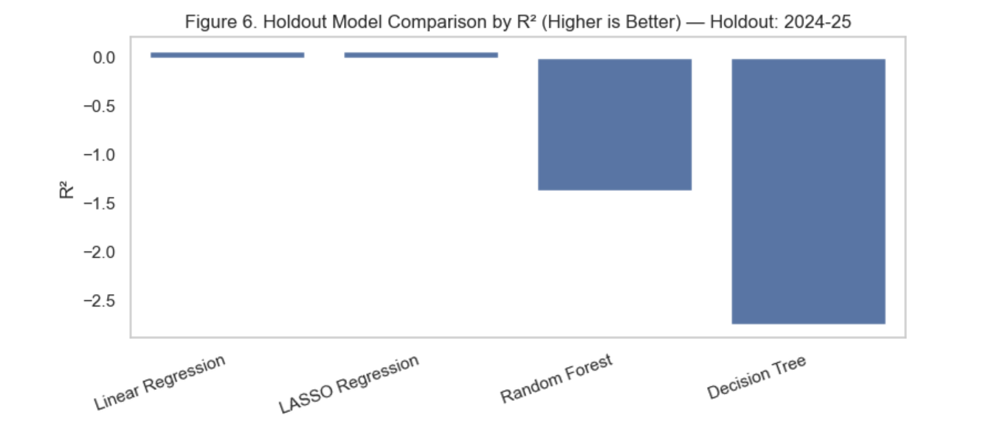
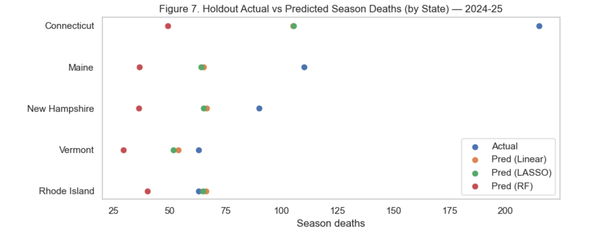
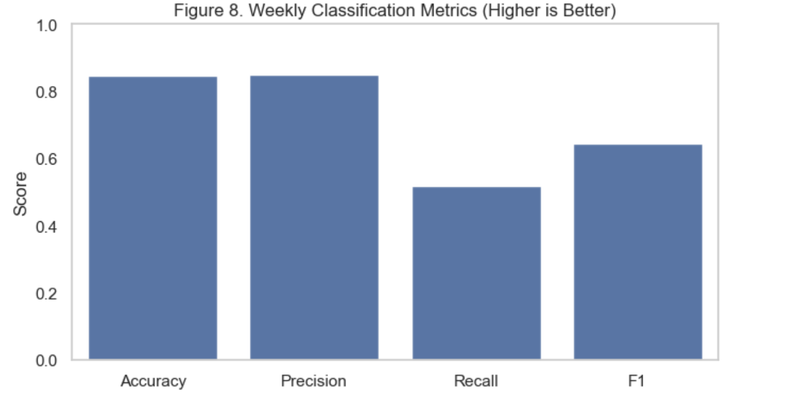
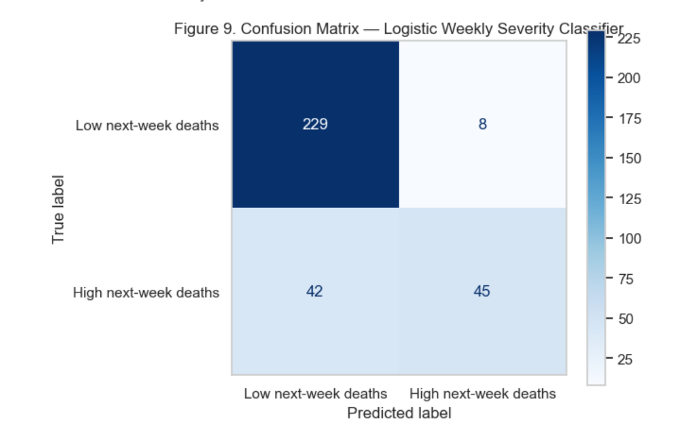

# Early-Season Influenza Surveillance as an Early-Warning Signal for End-of-Season Mortality in New England (2020–2025)

A healthcare analytics project examining whether early-season flu surveillance data can predict how severe a season will ultimately be — combining descriptive epidemiology, inferential regression (OLS/Poisson GLM), and predictive ML (Linear/LASSO/Decision Tree/Random Forest, plus a weekly logistic classifier).

**By Neha Save** 

## Overview

This project asks whether early-season influenza surveillance (weeks 40–52 of the CDC MMWR calendar) can act as an early-warning signal for how severe a flu season will end up being, using New England as the case study (2020–21 through 2024–25).

**Primary question:** Can early-season surveillance metrics (ILI and early deaths), plus simple lag features, predict end-of-season influenza mortality?

**Secondary question:** Which determinants are significantly associated with influenza deaths, and what policy levers do they suggest?

The analysis combines three layers:
1. **Descriptive epidemiology** — summary tables and charts of deaths, death rates, ILI, and virus activity by state and season
2. **Inferential modeling** — OLS and Poisson GLM regression to identify significant determinants of seasonal mortality (with incidence rate ratios, risk ratios, and odds ratios)
3. **Predictive modeling** — Linear Regression, LASSO, Decision Tree, and Random Forest models forecasting end-of-season deaths from early-season signals, plus a weekly logistic classifier for short-term surge detection

## Data note: Massachusetts excluded

Massachusetts mortality rates were not usable because several seasons had `total_deaths = 0`, which produces `NaN` or inflated rates. Massachusetts was excluded from all mortality-rate reporting and downstream modeling. The analysis covers **Connecticut, Maine, New Hampshire, Rhode Island, and Vermont**.

## Repository contents

| File | Description |
|---|---|
| `Final_Project_Code.ipynb` | Full analysis notebook (data cleaning, descriptive stats, regression, ML models, classification) |
| `NewEngland_Influenza_Mortality_2020-2025.csv` | State-level weekly influenza and total mortality counts |
| `ILINet.csv` | CDC ILINet outpatient influenza-like illness surveillance data |
| `VirusViewBySeason.csv` | Lab-confirmed influenza virus counts by season |
| `AgeViewBySeason.csv` | Lab-confirmed virus counts stratified by season and age group |
| `ILIAgeSummaryDataByWeek.csv` | Weekly ILI percentages stratified by age group |

## Methods

**Data prep:** Mortality fields converted to numeric; data filtered to New England; ILINet weeks re-mapped into influenza seasons (week ≥ 40 belongs to the season starting that year); age-group headers standardized; seasonal virus totals computed by summing age-stratified lab-confirmed counts.

**Inferential analysis:** Poisson GLM (season deaths as the outcome, since it's a count) with mean ILI, total patients, and total virus count as predictors, plus state and season fixed effects. Results reported as Incidence Rate Ratios (IRR). An OLS model was fit alongside as a simpler baseline.

**Predictive analytics (season-level):** Early-season deaths (weeks 40–52), early-season mean ILI, prior-season deaths (lag), and seasonal virus totals were used to predict total end-of-season deaths. Models — Linear Regression, LASSO (with cross-validated alpha), Decision Tree, and Random Forest — were trained on all seasons before 2024–25 and evaluated on a held-out 2024–25 test set (RMSE, MAE, R²).

**Classification (weekly-level):** A logistic regression pipeline (with feature scaling) predicted whether next-week deaths would exceed the season median, using lagged deaths, lagged ILI, and a 3-week ILI moving average. Evaluated with a confusion matrix and precision/recall/F1.

## Visualizations

**Weekly influenza deaths by season** — severe seasons (2022–23, 2024–25) show sharp early peaks; milder seasons stay flat.


**Distribution of end-of-season deaths by state** — Connecticut consistently has the highest burden and variability.


**ILI% over time by age group** — children aged 0–4 carry the highest ILI burden year-round.


**Mean ILI by season and state** — a clear upward trend across all states from 2020–21 to 2024–25.


**Choropleth: influenza mortality rate per 100k population (2020–2024)** — northern states (Maine, Vermont) show slightly higher cumulative rates.


**Holdout model comparison (RMSE, 2024–25)** — Linear Regression and LASSO clearly outperform tree-based models.


**Holdout model comparison (R², 2024–25)** — Random Forest and Decision Tree post negative R², signaling overfit on this small dataset.


**Actual vs. predicted end-of-season deaths by state (2024–25 holdout)** — shows where each model over/under-predicts, especially for Connecticut's high outlier season.


**Weekly classification metrics** — high accuracy/precision, more moderate recall.


**Confusion matrix — logistic weekly severity classifier** — correctly flags most low-severity weeks and about half of high-severity weeks in advance.


## Key findings

- Influenza mortality rose substantially after 2020–21, with sharp increases in 2022–23 and 2024–25. Connecticut had the highest absolute deaths (215 in 2024–25); Vermont had the highest death rate as a share of all-cause mortality (1.00% in 2024–25).
- In the Poisson GLM, **total lab-confirmed virus count** (p < .001) and **season effects** were the strongest, most significant predictors of seasonal deaths; **state effects** remained significant, pointing to persistent geographic heterogeneity. Mean ILI trended positive (IRR ≈ 1.62) but narrowly missed conventional significance (p ≈ .056).
- Seasons with high early-season ILI had **~2.17× the risk** and **~4.5× the odds** of ending in a high-mortality season compared to seasons with low early ILI.
- For season-level forecasting, **simple linear models beat tree-based models** on the 2024–25 holdout: Linear Regression and LASSO achieved RMSE ≈ 54 (R² ≈ 0.06–0.07), while Decision Tree and Random Forest had negative R², indicating overfitting on this small dataset (25 state-season observations). **Early-season deaths and prior-season deaths** were consistently the strongest predictors across all models; early ILI added weaker incremental value once those were included.
- The weekly logistic classifier for near-term surge detection performed well operationally: **84.6% accuracy, 84.9% precision, 51.7% recall, F1 = 0.643** — reliable when it flags a high-risk week, though it misses roughly half of true surges in advance.

## Recommendations

1. Use a two-layer early-warning system: a season-level forecast early on (weeks 40–52) for strategic planning, plus the weekly classifier for tactical surge response.
2. Treat early-season deaths and prior-season deaths as the primary leading indicators; use ILI as supporting context rather than the main driver.
3. Improve access to timely lab-confirmed virus surveillance, since it was the strongest significant predictor in the inferential model.
4. Set state-specific action thresholds rather than one regional standard, given persistent state-level differences in burden.
5. Resolve mortality-denominator data quality issues (e.g., Massachusetts) and extend the dataset in future work to improve model stability.

## Tools

Python (pandas, numpy, matplotlib, seaborn, plotly), scikit-learn (Linear Regression, LassoCV, Decision Tree, Random Forest, Logistic Regression, StandardScaler, Pipeline), statsmodels (OLS, Poisson GLM).

## How to run

```bash
git clone https://github.com/<your-username>/<repo-name>.git
cd <repo-name>
pip install -r requirements.txt
jupyter notebook Final_Project_Code.ipynb
```

All CSVs are included in the repo root, so the notebook runs end-to-end as-is.

## Data sources

- CDC FluView / ILINet: https://www.cdc.gov/fluview/index.html
- CDC FluView Interactive: https://gis.cdc.gov/grasp/fluview/fluportaldashboard.html
- State population estimates: FRED (Federal Reserve Economic Data)
